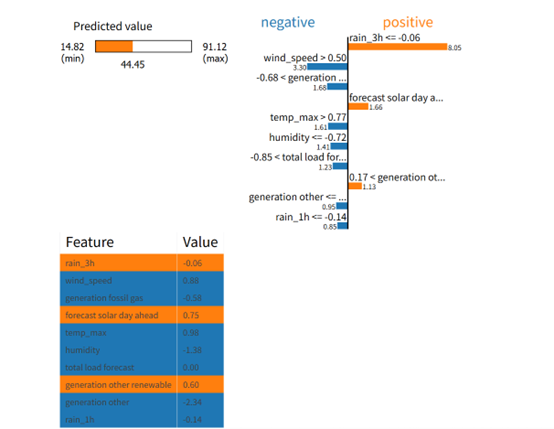

# ⚡ ML + LIME: Electricity Price Forecasting

This project focuses on **forecasting electricity prices** using multiple machine learning regression models, and explaining the results with **LIME (Local Interpretable Model-Agnostic Explanations)** to enhance model interpretability.

---

## 📌 Project Highlights

- 📊 **Energy price prediction** using historical energy, weather, and generation data.
- 🧠 **Multiple ML models** evaluated, including Linear Regression, Random Forest, XGBoost, SVR, etc.
- 🧪 **Ablation of models** using 6 different evaluation metrics.
- 📈 **LIME interpretability** applied to the best model to reveal local feature contributions.
- 🖼️ **Visualizations** including heatmaps, scatter plots, residual plots, and time series comparisons.

---

## 🛠️ Technologies Used

- Python 3.x
- pandas, numpy, matplotlib, seaborn
- scikit-learn
- XGBoost
- LIME

---

## 🔍 Workflow Overview

1. **Data Loading and Preprocessing**
   - Load and merge energy + weather datasets
   - Handle missing values and normalize features

2. **Exploratory Data Analysis (EDA)**
   - Feature correlation heatmap
   - Time-series and residual visualizations

3. **Modeling**
   - Trained models:
     - Linear Regression
     - Ridge
     - Decision Tree
     - KNN
     - SVR
     - Random Forest
     - Gradient Boosting
     - XGBoost
   - Evaluation metrics:
     - MAE, MSE, RMSE, R², MAPE, Explained Variance

4. **Model Interpretation**
   - Local explanation of predictions using `lime_tabular.LimeTabularExplainer`
   - Visual + tabular explanation in notebook

---

## 📊 Example Visualizations

- **Actual vs Predicted Prices**

  

- **Prediction vs Actual (First 100 Points)**

  

- **Residual Distribution**

  

- **Feature Correlation Heatmap**

  

> *(Make sure to place your plot images in an `assets/` folder in the repository root.)*

---

## 🧠 LIME Explanation Sample

LIME helps to understand **why** a model made a certain prediction for a single test point. Example output:



---

## 📂 Dataset

This project uses the following Kaggle dataset:

📍 [Energy Consumption, Generation, Prices and Weather](https://www.kaggle.com/datasets/nicholasjhana/energy-consumption-generation-prices-and-weather)

---

## 📦 Installation

```bash
pip install pandas numpy matplotlib seaborn scikit-learn xgboost lime
